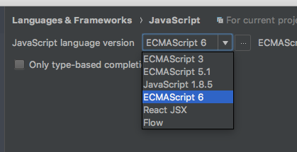

# eslint-plugin-harmony

[![NPM version][npm-image]][npm-url]
[![NPM downloads][downloads-image]][downloads-url]
[![Build status][travis-image]][travis-url]

[![Greenkeeper badge][green-keeper-image]][green-keeper-url]
[![semantic-release][semantic-release-image]][semantic-release-url]

[![Visual Studio Code][vscode-image]][vscode-url]
[![phpStorm][phpStorm-image]][phpStorm-url]
[![Atom][atom-image]][atom-url]

A [`eslint`](https://eslint.org/) config styles package that work across IDEs.

## Design Principles

There are several configurations available in this package.
Although they are different as they are designed for different programers,
here are the principles that they all follows:

- They are designed to be used by team
- Each team member can use one of the supported IDE
- The formatter available on each IDE should work with each configuration
- Code should look well and consistent on each IDE with folding
  - so that when you stop by your team member's cube, the code looks the same.
- Thrive for easy to write (with fewest keystrokes) while keeping the code clean

## Supported IDE

- Visual Studio Code (1.20.0): <https://code.visualstudio.com/>
- phpStorm (2017.3.4): <https://www.jetbrains.com/phpstorm/>
- Atom (1.24.0): <https://atom.io/>

## Installation

You'll first need to install [ESLint](http://eslint.org):

```sh
npm install --save-dev eslint
```

Next, install `eslint-plugin-harmony`:

```sh
npm install --save-dev eslint-plugin-harmony
```

**Note:** If you installed ESLint globally (using the `-g` flag) then you must also install `eslint-plugin-harmony` globally.

## Usage

To use the eslint style, extends from one of the following:

```js
{
  "extends": "plugin:harmony/recommended",
  "extends": "plugin:harmony/latest",
  "extends": "plugin:harmony/es5",
  "extends": "plugin:harmony/es5-strict",
  "extends": "plugin:harmony/ts-prettier", // experimental
  "extends": "plugin:harmony/ts-recommended", // or use overrides
  "extends": "plugin:harmony/ts-recommended-requiring-type-checking", // or use overrides
}
```

### TypeScript

The TypeScript style is extended from [`@typescript-eslint/eslint-plugin`](https://github.com/typescript-eslint/typescript-eslint/tree/master/packages/eslint-plugin).

They are adjusted to the style in harmony.
Also, the configuration are simplified.

Since you will likely to have some JavaScript files in your TypeScript project (e.g. `jest.config.js`, `webpack.config.js`, etc),
it is recommended to use the `overrides.extends` feature in `eslint` to support mixed environment:

```js
{
  "extends": [
    "plugin:harmony/recommended"
  ],
  "overrides": [
    {
      "files": [
        "*.ts",
        "*.tsx"
      ],
      "extends": [
        "plugin:harmony/ts-recommended"
      ]
    }
  ]
}
```

Note that for `ts-recommended-requiring-type-checking` you still need to specify `parserOptions.project`.

For more information, please check out [@typescript-eslint/eslint-plugin](https://github.com/typescript-eslint/typescript-eslint/tree/master/packages/eslint-plugin).

### JetBrains IDE

After you import the settings,
you need to use them in the setting:


You also need to change your language version approprately:




## Contribute

```sh
yarn
yarn bootstrap
```

[npm-image]: https://img.shields.io/npm/v/eslint-plugin-harmony.svg?style=flat
[npm-url]: https://npmjs.org/package/eslint-plugin-harmony
[downloads-image]: https://img.shields.io/npm/dm/eslint-plugin-harmony.svg?style=flat
[downloads-url]: https://npmjs.org/package/eslint-plugin-harmony
[travis-image]: https://img.shields.io/travis/unional/eslint-plugin-harmony/master.svg?style=flat
[travis-url]: https://travis-ci.org/unional/eslint-plugin-harmony?branch=master
[green-keeper-image]:
https://badges.greenkeeper.io/unional/eslint-plugin-harmony.svg
[green-keeper-url]:https://greenkeeper.io/
[semantic-release-image]:https://img.shields.io/badge/%20%20%F0%9F%93%A6%F0%9F%9A%80-semantic--release-e10079.svg
[semantic-release-url]:https://github.com/semantic-release/semantic-release
[vscode-image]:https://img.shields.io/badge/vscode-ready-green.svg
[vscode-url]:https://code.visualstudio.com/
[phpStorm-image]:https://img.shields.io/badge/phpStorm-ready-green.svg
[phpStorm-url]:https://www.jetbrains.com/phpstorm/
[atom-image]:https://img.shields.io/badge/atom-ready-green.svg
[atom-url]:https://atom.io/
